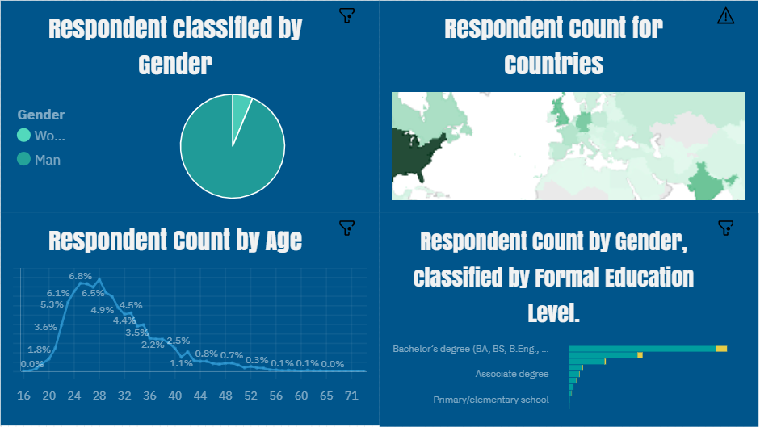

<h1> Welcome to my dashboards page </h1>

Presented by Alaa Salama

<h3>Who am I ?</h3>

My Name is Alaa Salama, I graduated from Scientific Computing department of faculty of Computers and Artificial Intelligence Benha University 2020 , and then I finished my military service since dec 2021 

<h3>The Goal of this page</h3>

I thought to create this page to present my work on dashboards because i find this is the best way to present my dashboards, so I hope you rate me and advice me to be a good page you can contact me by <b style='color:blue'>mr.3laa.salam@gmail.com</b>

<h3>My Experince</h3>

I have a nice experience as a fresh data analyst 

<b style='color:red'>1</b>- Graduation Project is the first and amazing experience, It was a text detection and recognition system using CTPN Connectonist Text Proposal Network it was very hard experience as a senior student but i learnt alot from this experience.

  <b style='color:red'>2</b>- My awesome second experience is 
  <b>IBM Data Analysis Professional Certificate</b> , I learnt alot and alot from this specialization it was full of information, Through this journey i worked on data analysis with excel(data cleaning and data visualization), and SQL by doing alot of queries on a specified databae and in the final I worked on data analysis with amazing python language with <b>Numby, Pandas and Sciby </b> and i applied with python on alot of datasets by doing <b>data cleaning , EDA Exploratory Data Analysis and data visualization </b> 

  

<b style='color:red'>3</b>- <b>Technocolabs Software Remotely Internship</b> , this is my third amazing experience in my data analysis journey, this internship made me work on a project on Companies dataset to apply all data analysis steps from data cleaning and EDA to data visualization, I worked with my team to do tasks and our mentor guided us to the right direction of search, if any thing we can't solve.
  
  

<h3>Introduction</h3>

You will find here all my dashboards and it will be updated inshallah, So I worked on alot of projects but not all projects i created dashboards for it, but now i try to collect my dashboards in one page so i can prove my experience.

<h3 >Dashboard 1:</h3>

This dashboard is created by IBM cloud pak for data, you can see the original dashboard <a href='https://eu-gb.dataplatform.cloud.ibm.com/dashboards/fe727237-e62c-4695-a052-3f0ea7f66ccc/view/7238f20b33e86d9f44c9eee4079d7a037963715bbabb8051808c7b495b647997a93b41c0c82f425cdf445030f7bf1b59ce'>Here</a>

<h3 >Dashboard 2:</h3>

This dashboard is created by IBM cloud pak for data, you can see the original dashboard from <a href='https://eu-gb.dataplatform.cloud.ibm.com/dashboards/4194f97c-f364-4c0c-83a7-202f1afa6637/view/5465fd786fb02dca68d7c4e4079d7a037963715bbabb8051808c7b495b647997a93b41c0c82f425cdf445030f7bf1b59ce'>Here</a>

<h3 >Dashboard 3:</h3>

This dashboard is created by IBM cloud pak for data, you can see the original dashboard from <a href='https://eu-gb.dataplatform.cloud.ibm.com/dashboards/2d1757dc-4863-4252-9883-8ab87e9b7a84/view/0104a1081eb46cf77ed7b1e4079d7a037963715bbabb8051808c7b495b647997a93b41c0c82f425cdf445030f7bf1b59ce'>Here</a>

